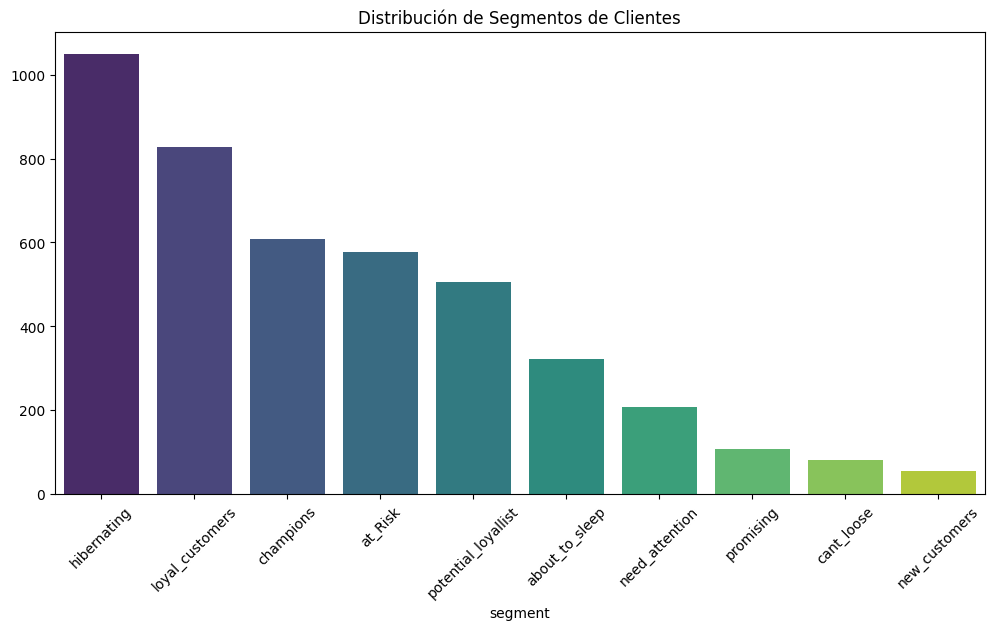

# Proyecto: Segmentación de Clientes Retail (Análisis RFM)

Este proyecto transforma un dataset transaccional bruto de E-commerce mediante ingeniería de características en una matriz estratégica de **Recencia, Frecuencia y Valor Monetario (RFM)**. El objetivo es agrupar a los consumidores para diseñar estrategias de marketing segmentadas y optimizar la retención.

## Hallazgos Principales y Visualización de Segmentos

Evaluamos el volumen total de clientes que componen cada categoría comercial para medir el impacto de las campañas. A continuación se presenta la distribución obtenida:

### Distribución del Tamaño de los Segmentos

## Conclusiones del Negocio

* **Oportunidad de Reactivación:** El segmento más voluminoso identificado es **"Hibernating"**, seguido de **"Loyal Customers"**. Esto indica un enorme potencial para diseñar campañas de re-engagement automatizadas que recuperen ingresos latentes de usuarios que ya conocen la marca pero llevan tiempo sin interactuar.
* **Optimización de Recursos:** Al tener estructurada la base de datos, el equipo de marketing puede personalizar las comunicaciones y los incentivos según el valor real de cada grupo, evitando descuentos masivos innecesarios y protegiendo el margen de ganancia.

## Herramientas Utilizadas
* Python (Pandas, NumPy)
* Visualización de datos (Matplotlib, Seaborn)
* Análisis estadístico descriptivo